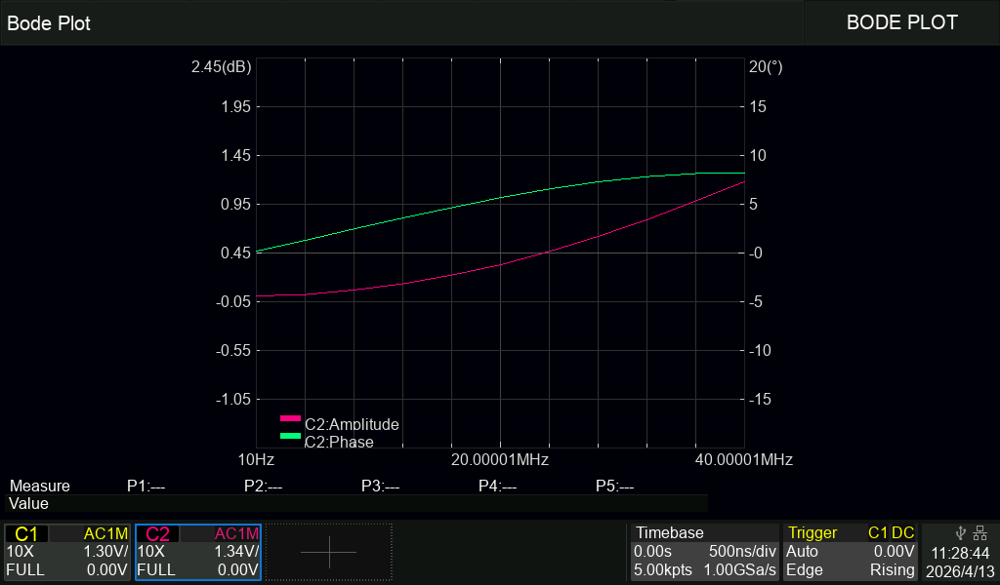
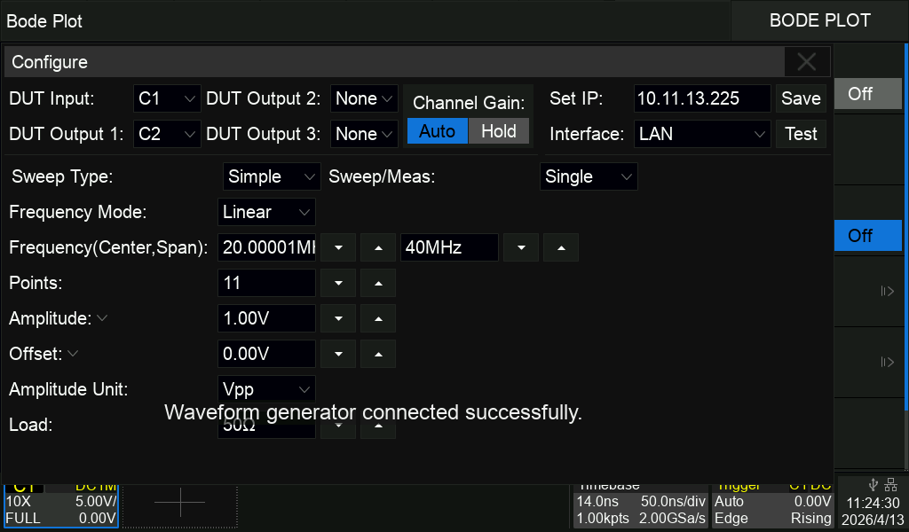

# WT32-ETH01 Bode Bridge

Firmware for `WT32-ETH01` that bridges a `FeelElec / FeelTech FY6900` function generator to the Bode feature of a `Siglent SDS800X-HD` oscilloscope, while also exposing the oscilloscope web UI through an HTTP proxy and a noVNC/WebSocket proxy.

The main production-oriented build kept in this repository is:

- `wt32eth_release_final_safe`

Auxiliary kept builds:

- `wt32eth_bringup_safe`
- `wt32eth_final_test_safe`

Supporting documents:

- [BUILDING.md](BUILDING.md)
- [FLASHING.md](FLASHING.md)
- [RELEASE_NOTES.md](RELEASE_NOTES.md)
- [docs/VALIDATION_SUMMARY.md](docs/VALIDATION_SUMMARY.md)

## Overview

This project combines three functions in one WT32-ETH01 module:

- `FY6900 bridge`: UART2 control of the function generator
- `scope-side Ethernet LAN`: dedicated static network for the oscilloscope, Bode/VXI services, and the minimal LAN NTP server
- `WiFi upstream and UI access`: 2.4 GHz WiFi STA for upstream connectivity, internet time source access, and convenient UI access

In the final main build, the recovery AP also remains active so the UI is still reachable locally while Ethernet and WiFi STA are in use.

## Architecture


*WT32-ETH01 configuration and runtime UI in the final project state.*


*Oscilloscope web UI exposed through the WT32 HTTP proxy / noVNC path.*

## Hardware Roles

### WT32-ETH01

- controls the FY6900 through UART2
- exposes Bode/VXI services toward the oscilloscope on the dedicated Ethernet LAN
- provides the local configuration UI
- serves a minimal LAN-side NTP service for the oscilloscope
- proxies the oscilloscope web UI for browser access

### FY6900

- generates the excitation signal
- is controlled only through UART2
- in the validated setup, only `Channel 1` is used for the Bode measurement path

### Siglent SDS800X-HD

- uses `Channel 1` as the direct reference input
- measures the DUT response on `Channels 2 to 4`, depending on the test setup
- connects by RJ45 Ethernet to the dedicated WT32 LAN
- uses the WT32 LAN-side NTP service and Bode/VXI services on that dedicated oscilloscope-side network

## Physical Connections

### Signal Path

The measurement path should be wired like this:

1. Use only `FY6900 Channel 1` as the source.
2. Split the `FY6900 Channel 1` output with a `BNC T splitter`.
3. Route one branch of that splitter directly to the oscilloscope reference input on `Scope Channel 1`.
4. Route the other branch from the splitter to the `DUT`.
5. Measure the DUT response on oscilloscope `Channels 2 to 4`, as required by the test.

That means:

- `Scope CH1` = reference channel
- `Scope CH2` / `CH3` / `CH4` = DUT measurement channels

Important: all oscilloscope channels used in the DUT measurement path must be externally terminated to 50 Ω. The SDS800X HD only provides 1 MΩ inputs and does not offer a built-in 50 Ω input mode, so external BNC 50 Ω feed-through terminators are mandatory for this setup.

### UART And Grounding

- `UART0` for flashing/logs:
  - `IO1 = TX0`
  - `IO3 = RX0`
- `UART2` for FY6900:
  - `IO17 = TXD2` -> `FY6900 RX`
  - `IO5 = RXD2` <- `FY6900 TX`
- a correct common ground between WT32-ETH01 and FY6900 is required

### Voltage-Level Caution

The WT32/ESP32 GPIO path is `3.3 V logic`. The `FY6900 TX -> WT32 RX` path must therefore also be `3.3 V-safe`. If your FY6900 serial TX level exceeds `3.3 V`, add level shifting or a divider before feeding `IO5`.

## Network Topology

### Dedicated Scope-Side LAN

- use an `RJ45 Ethernet cable` between the `DSO` and the `WT32-ETH01`
- this is the dedicated oscilloscope-side LAN
- default WT32 LAN IP: `10.11.13.221/24`
- default scope IP: `10.11.13.220`
- LAN gateway: `0.0.0.0`
- LAN DNS: `0.0.0.0`

This is the correct wording. The RJ45 cable is between the `DSO` and the `WT32-ETH01` on the dedicated LAN. The `FY6900` is not connected by RJ45.

Role of the dedicated LAN:

- oscilloscope-side network
- Bode/VXI transport
- scope probe reachability
- LAN-side NTP service exposed by the WT32
- proxy target path toward the oscilloscope

### WiFi STA

- the WT32-ETH01 uses `2.4 GHz WiFi`
- WiFi STA is used for upstream connectivity
- WiFi STA can provide internet access needed for upstream NTP time acquisition
- WiFi STA is also a convenient access path for the WT32 Web UI
- WiFi STA can be configured as DHCP or static in the UI

Role of WiFi:

- upstream connectivity
- internet access for time synchronization
- browser access to the WT32 UI

Final default network policy in the release build:

- WiFi STA default: `DEF_USE_DHCP = 1`; the stored static tuple starts unset and is only used after an explicit user configuration
- dedicated LAN default: `DEF_IP` remains the WT32 scope-side LAN default at `10.11.13.221/24`
- recovery AP default: fixed `192.168.4.1/24` on its own subnet
- `DEF_IP` is no longer reused as an implicit WiFi STA static default, which avoids an immediate STA/LAN subnet conflict on clean NVS

### Permanent Recovery AP

- default SSID: `WT32-BODE-SETUP`
- default password: 'wt32-bode'
- default IP: `192.168.4.1/24`
- kept active in the final main build as a recovery/service path

## Final Architecture Summary

- `LAN` = dedicated oscilloscope-side network
- `WiFi` = upstream connectivity, UI access, and upstream NTP source
- `AP` = recovery and local service access
- `UART2` = FY6900 control

## Final Persistence Policy

- normal `Preferences` / `NVS` writes happen only on explicit user actions such as `Save` in the Web UI or `Factory reset`
- `Save` with an unchanged resulting configuration is a no-op and reports `No changes saved` instead of rewriting flash
- there is no periodic autosave, background save, or runtime save loop in the final main build
- boot-time automatic writes are kept only for critical cases: legacy migration, failed configuration load, or a critical repair that is needed to make the stored configuration coherent enough to boot correctly
- minor normalization that does not block coherent operation stays in RAM until the user performs an explicit save

Behavior on clean NVS / first boot:

- WiFi STA comes up in DHCP mode by default
- the dedicated LAN stays static on `10.11.13.221/24`
- the recovery AP stays available on `192.168.4.1/24`
- a single boot-time commit is still allowed if essential defaults or migration data must be materialized into `NVS`

## Build Variants Kept

### `wt32eth_release_final_safe`

Main public build with:

- Ethernet scope LAN
- WiFi STA
- permanent recovery AP
- minimal LAN NTP server
- Bode/VXI runtime
- FY6900 runtime support
- configurable Web UI connection limit on port `80`
- configurable HTTP proxy connection limit on port `100`
- configurable noVNC/WebSocket connection limit on port `5900`

### `wt32eth_bringup_safe`

Recovery build that forces AP, ignores stored configuration, and keeps FY hardware disabled at boot.

### `wt32eth_final_test_safe`

Manual FY6900 service build used for controlled UART2 and FY validation without treating it as the normal end-user runtime.

## Web UI And Usage



*Example Bode-related oscilloscope screen from the validated setup.*


*Example oscilloscope Bode settings screen used in the documented workflow.*



*Example confirmation screen during the measured workflow.*


*Example timing confirmation screen from the validated setup.*

Useful routes in the final build:

- `/` runtime status
- `/network` WiFi STA, AP, LAN, and NTP upstream configuration
- `/scope` scope target IP and proxy configuration
- `/fy6900` FY UART2 configuration
- `/bode` Bode-related stored parameters
- `/diag` runtime diagnostics

In the current bench setup, the Web UI can be reached at:

- `http://192.168.91.157`

HTTP service connection limits in the final build:

- port `80` (`Web UI`), port `100` (`scope HTTP proxy`), and port `5900` (`noVNC/WebSocket proxy`) are limited independently
- each limit is configurable from the Web UI in the range `2..30`
- the factory/default value for each of the three limits is `6`
- when a limit is reached, the extra incoming connection receives `HTTP 503 Service Unavailable`, then `Connection: close`, and is closed immediately

Web UI save behavior in the final build:

- unchanged form submissions do not rewrite `NVS`
- changed form submissions persist normally and report `Configuration saved`
- the same save/no-save behavior is shared by the relevant Web UI configuration sections because the write decision is centralized around `saveConfig()`

Typical use flow:

1. power the WT32-ETH01 and connect the oscilloscope by RJ45 to the dedicated LAN
2. connect WT32 UART2 to the FY6900 UART
3. wire FY6900 Channel 1 through the BNC T splitter
4. route one splitter branch to scope `CH1` and the other to the DUT
5. connect DUT measurement returns to scope `CH2` to `CH4` as required
6. access the WT32 Web UI from AP, WiFi STA, or LAN
7. configure WiFi STA if upstream internet/NTP access is required
8. configure `Scope IP` in the Scope tab to match the oscilloscope Ethernet address
9. verify the scope UI through `http://<ESP32_IP>:100/` or through noVNC if needed

## FY6900 Runtime And Protocol

Validated FY6900 settings in this project:

- baud rate: `115200`
- serial mode: `8N2`
- serial timeout: `1200 ms`
- flow control: `none`
- command termination: `LF`

Recommended read-only test commands:

- `UMO`
- `UID`
- `RMN`

The final release build uses deferred FY initialization so that the network and UI can come up before FY initialization completes.

## Scope Proxy

### HTTP Proxy

- listens on `http://<ESP32_IP>:100/`
- forwards to `scope_ip:80`
- intended for the oscilloscope web pages
- has an independent configurable simultaneous-client limit in the Web UI (`2..30`, default `6`)

### noVNC / VNC Proxy

- listens on `ws://<ESP32_IP>:5900/websockify`
- forwards to `scope_ip:5900`
- has an independent configurable simultaneous-client limit in the Web UI (`2..30`, default `6`)

### Web UI Server

- listens on `http://<ESP32_IP>/`
- has its own independent configurable simultaneous-client limit in the Web UI (`2..30`, default `6`)

### LAN NTP Service

- serves NTP only for clients that originate from the dedicated scope-side LAN subnet
- does not answer AP-side or non-LAN requests
- applies a fixed lightweight UDP rate limit before replying: `8 requests / second / source IP` and `16 requests / second` globally, in a `1000 ms` window
- ignored requests outside the LAN policy, or beyond the NTP rate limit, are dropped silently

## Build And Flash

Main build:

```bash
pio run -e wt32eth_release_final_safe
```

Main upload:

```bash
pio run -e wt32eth_release_final_safe -t upload --upload-port COMx
```

Auxiliary builds:

```bash
pio run -e wt32eth_bringup_safe
pio run -e wt32eth_final_test_safe
```

Export tracked release binaries:

```bash
python scripts/build_bins.py
```

Detailed instructions:

- [BUILDING.md](BUILDING.md)
- [FLASHING.md](FLASHING.md)

The main prebuilt firmware artifacts are kept in:

- [release/wt32eth_release_final_safe/app.bin](release/wt32eth_release_final_safe/app.bin)
- [release/wt32eth_release_final_safe/bootloader.bin](release/wt32eth_release_final_safe/bootloader.bin)
- [release/wt32eth_release_final_safe/partitions.bin](release/wt32eth_release_final_safe/partitions.bin)

## Programming, Power, And UART Notes

### Entering Bootloader Mode For Flashing

For manual flashing, hold `GPIO0` low during power-up, or keep `GPIO0` low and briefly pull `EN` to `GND` to reset the board into the ROM bootloader.

### Recommended USB-TTL Programming Connection

Use a `3.3 V logic` USB-TTL adapter and cross the UART0 data lines:

- `WT32 TXD / IO1 / TXD0` -> adapter `RX`
- `WT32 RXD / IO3 / RXD0` -> adapter `TX`
- `WT32 GND` -> adapter `GND`

### ESP32 ROM Bootloader Serial Settings

For the ESP32 ROM bootloader through UART0, use:

- baud rate: `115200`
- data bits: `8`
- stop bits: `1`
- parity: `none`
- flow control: `none`

### Runtime Serial Monitor Settings

For runtime logs on UART0, use:

- baud rate: `115200`
- data bits: `8`
- stop bits: `1`
- parity: `none`
- flow control: `none`

Do not mix these UART0 settings with the FY6900 UART2 link, which is validated here as `115200 8N2`.

### Power Supply Requirements

- WT32-ETH01 supports either `5 V` or `3.3 V` input power, but not both at the same time
- the module datasheet specifies a minimum `500 mA` supply capability
- a stable `1 A` capable supply is recommended for this project

### Practical Decoupling Recommendation

For reliable flashing and runtime stability, add a `470 uF` low-ESR or polymer capacitor between `3.3V` and `GND`, with short leads.

## Boot, Flash, And Physical Intervention

If automatic bootloader entry does not work on your board, you must perform the physical boot/reset steps locally. This project does not assume that flashing can always be completed without manual intervention.

Use `UART0` for flashing and logs, and `UART2` only for FY6900 control.

## Recommended Minimum Test

1. build `wt32eth_release_final_safe`
2. flash it to the board
3. if auto-reset does not enter the bootloader, put the board into boot mode and perform a manual hardware reset
4. check on serial that LAN, STA/AP, and proxy statuses appear
5. check the UI on one of the active addresses
6. check Bode/NTP on LAN
7. check `http://<ESP32_IP>:100/`
8. check noVNC through the proxied scope UI

## Known Real Limitations

- the final state targets up to `2` simultaneous noVNC clients
- `wss://` / TLS is not provided
- the project assumes correct power, grounding, and serial-level wiring
- long-term stability beyond the retained validation sessions is not claimed automatically by the code alone

## Validation Baseline

The retained local validation history for the kept builds is summarized in:

- [docs/VALIDATION_SUMMARY.md](docs/VALIDATION_SUMMARY.md)

At release-preparation level, the following were already validated locally:

- `wt32eth_release_final_safe`
- `wt32eth_bringup_safe`
- `wt32eth_final_test_safe`

Final release validation completed locally on `2026-04-13` for `wt32eth_release_final_safe`:

- clean build completed successfully with `pio run -e wt32eth_release_final_safe -t clean; pio run -e wt32eth_release_final_safe`
- erase + flash + boot capture on `COM6` completed successfully
- first boot after erase showed `stored_config_valid=no`, `dhcp=on`, LAN `10.11.13.221/24`, recovery AP `192.168.4.1`, and both proxy listeners active
- live Web UI access was verified at `http://192.168.91.157/`
- a real Web UI save with unchanged `service_limits` returned `No changes saved`
- a real Web UI save changing `max_web_ui_clients` from `6` to `7` returned `Configuration saved`, and `/network` reflected the new stored value
- the value was restored from `7` back to `6`, again through the final Web UI, and `/network` reflected the restored default
- the runtime status page stayed healthy after the tests: LAN active, WiFi STA connected, AP active, time synced, scope reachable, HTTP proxy listening, and noVNC proxy listening
